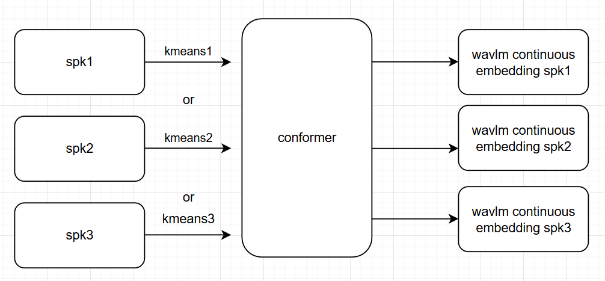

# Multiple Kmeans

This experiment trains a single conformer model using different kmeans model from different speakers rather than a single one.

## Pre-requistie

1. go to `exp/multiple_kmeans` if you are in repository root directory
2. Download conformer model from here to `ckpt/`

## Experiments overview

Here, I offer two inference experiments

1. For each audio, utilize random kmeans model to infer. (For each audio, only use one kmeans model.)
2. For each audio, utilize random kmeans on different frames in one single audio. (For each audio, use different kmeans model on different frames)

### 1. Random Kmeans per audio

### 2. Random Kmeans for each frame

