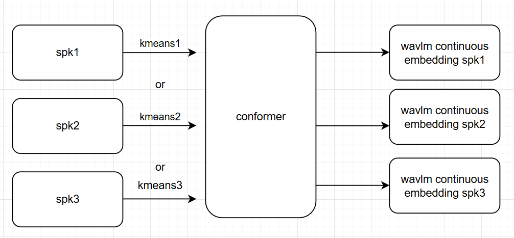

# Multiple Kmeans Train One Conformer

This experiment trains a single conformer model using different kmeans model from different speakers rather than a single one.




## Pre-requistie

1. go to `exp/multiple_kmeans_one_conformer` if you are in repository root directory
2. Download conformer model from [here](https://drive.google.com/file/d/1E9NDTnsQp73bHu1Xn8-aTdPDqq1w0K5x/view?usp=sharing) to `ckpt/`

## Experiments overview

Here, I offer two inference experiments

1. For each audio, utilize random kmeans model to infer. (For each audio, only use one kmeans model.)
2. For each audio, utilize random kmeans on different frames in one single audio. (For each audio, use different kmeans model on different frames)


### 1. Random Kmeans per audio

```shell
ckpt=<path-to-conformer-ckpt> # downloaded above

kmeans_scp=<path-to-kmeans-scp> # see exp/kmeans_random_frame/README.md for how kmeans_scp should look like
audio_scp=<path-to-audio-scp>
output_dir=<path-to-output>
wavlm_ckpt=<path-to-wavlm-ckpt>

gpus="cuda:0 cuda:1 cuda:2 cuda:3"
num_proc=8


python inference_audio_multi_kmeans.py --kmeans_scp $kmeans_scp --audio_scp $audio_scp \
    --output_dir $output_dir --wavlm_ckpt $wavlm_ckpt \
    --ckpt $ckpt \
    --num_proc $num_proc \
    --gpus $gpus \
    # --kmeans_num <int> 
```

Note that you can also add `--kmeans_num <int>` to specify how many random kmeans models will be chosen from `kmeans_scp` rather than using all the kmeans models. 


### 2. Random Kmeans for each frame

Note that we use `stride` control the number of the consecutive frames that are from the same kmeans model.

```shell
ckpt=<path-to-conformer-ckpt> # downloaded above

kmeans_scp=<path-to-kmeans-scp> # see exp/kmeans_random_frame/README.md for how kmeans_scp should look like
audio_scp=<path-to-audio-scp>
output_dir=<path-to-output>
wavlm_ckpt=<path-to-wavlm-ckpt>

gpus="cuda:0 cuda:1 cuda:2 cuda:3"
num_proc=8

# control the number of the consecutive frames that are from the same kmeans model
stride=1


python inference_audio_random_frame.py --kmeans_scp $kmeans_scp --audio_scp $audio_scp \
    --output_dir $output_dir --wavlm_ckpt $wavlm_ckpt \
    --ckpt $ckpt \
    --num_proc $num_proc \
    --gpus $gpus \
    --stride $stride
    # --kmeans_num <int> 
```


